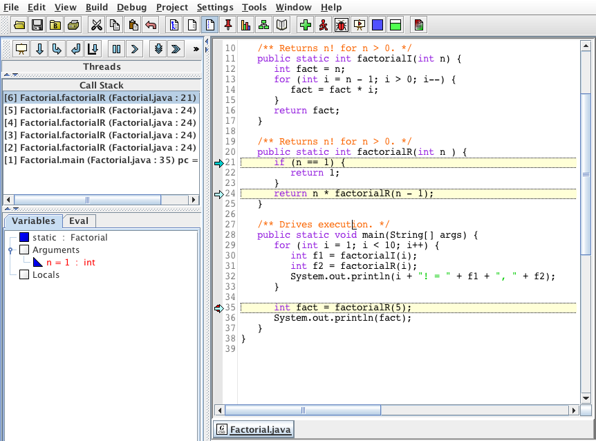
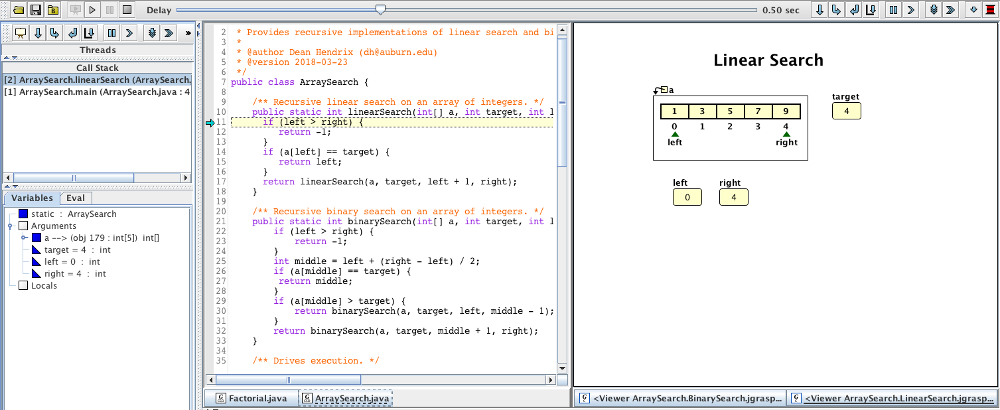
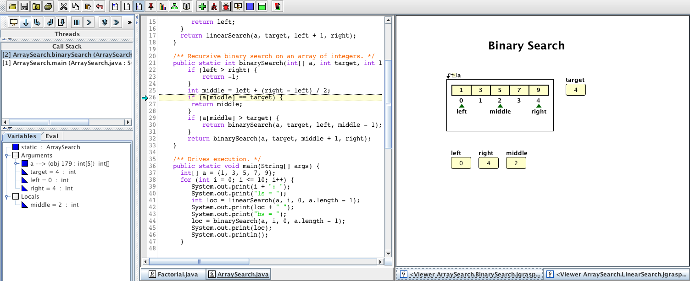

# Hands-On: Recursion

This activity is designed to put into practice the concepts presented in the
course material on Recursion. You should study those course materials before
attempting this activity.

You will need the following files to complete this actiity.

- [`Factorial.java`](src/Factorial.java)
- [`ArraySearch.java`](src/ArraySearch.java)
- [`ArraySearch.BinarySearch.jgrasp_canvas.xml`](src/ArraySearch.BinarySearch.jgrasp_canvas.xml)
- [`ArraySearch.LinearSearch.jgrasp_canvas.xml`](src/ArraySearch.LinearSearch.jgrasp_canvas.xml)

## Factorial

1. Open `Factorial.java` in jGRASP, then compile and run it. Observe the output to understand what the `main` method is doing.

1. Set a breakpoint on line 35: `int fact = factorialR(5);`

1. Start the debugger and wait until execution is paused at the breakpoint.

1. Step in to the call to `factorialR`. Your screen should look similar to the image below.

	

1. Continue to step in to the recursive calls until execution reaches the base case (n = 1). Your screen should look similar to the image below.

	

1. Note that the activation record or stack frame for each call (activation) of the `factorialR` method is listed in the Call Stack tab of the debugger window. Click on the different activation records to see the value of `n` in that activation as well as the line at which that activation is paused in execution.

1. Click on the top activation record on the call stack.

1. Step over the remaining return statements and watch as the activation records are removed each time an activation of `factorialR` returns. Finally, observe that the value of `factorialR(5)` is returned to `main` and is then printed to `System.out`.

## ArraySearch

1. Open `ArraySearch.java` in jGRASP, then compile and run it. Observe the output to understand what the `main` method is doing.

1. Set a breakpoint on line 49: `int loc = linearSearch(a, 4, 0, a.length - 1);`

1. Start the debugger and wait until execution is paused at the breakpoint.

1. Step in to the call to `linearSearch`.

1. Click on the Open Canvas button () and open the `ArraySearch.LinarSearch` Canvas from the menu. Your screen should look similar to the image below.

	

1. Use the debugger controls to step through each recursive call. Observe the activation records being created on the call stack, and observe the viewer canvas changing to show the progress of the recursive linear search.

1. Continue to explore `linearSearch` in debug mode until you are confident that you understand the recursive execution of this method, and then end the program.

1. Set a breakpoint on line 50: `loc = binarySearch(a, 4, 0, a.length - 1);`

1. Start the debugger and wait until execution is paused at the breakpoint.

1. Step in to the call to `binarySearch`.

1. Click on the Open Canvas button () and open the `ArraySearch.BinarySearch` Canvas from the menu. Your screen should look similar to the image below.

	

1. Use the debugger controls to step through each recursive call. Observe the activation records being created on the call stack, and observe the viewer canvas changing to show the progress of the recursive binary search.

1. Continue to explore `binarySearch` in debug mode until you are confident that you understand the recursive execution of this method, and then end the program.

## Submission 

The submission page for this activity asks you to apply your understanding of
recursion to a problem and then submit it for a grade.

